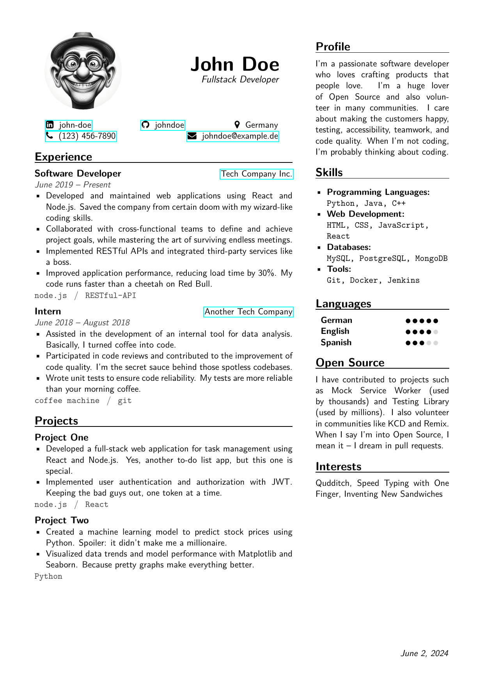

# John Doe's Super-Awesome LaTeX Resume Template 🚀




Welcome to the ultimate LaTeX template for crafting the most epic 1-page resume for none other than the legendary John Doe! If you're here, you're probably looking to create a resume that screams "I mean business" while subtly whispering "I'm also pretty fun." Look no further, friend.

## What's Inside? 📦

- **1-Page Resume**: Because less is more, and John Doe doesn't need two pages to impress.
- **LaTeX Magic**: Beautifully typeset, thanks to the power of LaTeX.
- **Dockerized Build**: Compile your resume without the mess, all neatly packaged in a Docker container.
- **PNG Conversion**: Get a spiffy PNG image of the first page for all your README and social media bragging needs.

## How to Use This Magical Template ✨

### Prerequisites

- Docker (because who doesn't love containerization?)
- Make (the command, not the effort)

### Step-by-Step Guide

1. **Build the Docker Image** 🛠️

   Run this command to build the Docker image. It's like baking a cake, but less messy.

   ```shell
   make build
   ```

2. **Compile the LaTeX to PDF** 📄

   Turn that LaTeX code into a sleek PDF with a single command. Voilà!

   ```shell
   make pdf
   ```

3. **Convert the First Page to PNG** 🖼️

   Because sometimes you just need a picture. Create a PNG image of the first page.

   ```shell
   make png
   ```

4. **Clean Up** 🧹

   Keep your workspace tidy. Clean up all those auxiliary files.

   ```shell
   make clean
   ```

## John Doe: A Man of Mystery and Talent 🕵️‍♂️

Who is John Doe? He's a mystery wrapped in an enigma, with a resume that dazzles. Use this template to channel your inner John Doe and create a resume that’s out of this world.

---

Happy TeX-ing! 🎉
